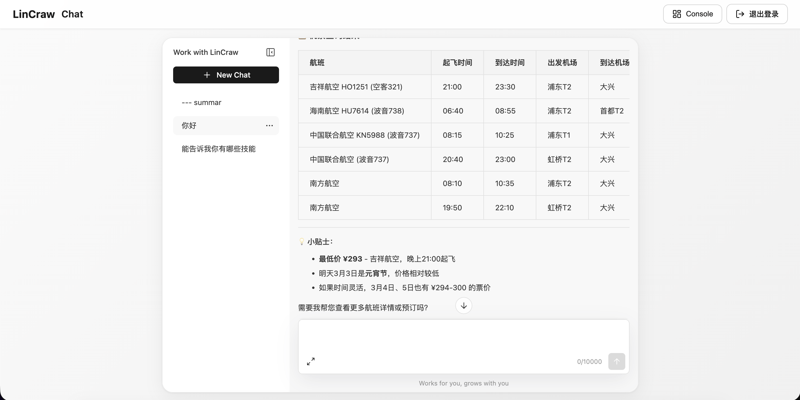

# LinClaw

基于七牛云的 AI 个人助理，支持钉钉、飞书、QQ 等多端接入。




## 环境要求

- Python 3.10+
- Node.js 20+
- pnpm

## 安装

```bash
git clone https://github.com/sunqirui1987/linx-craw.git
cd linx-craw
pip install -e .
cd console && pnpm install && pnpm run build
cp -R dist/* ../src/aicraw/console/
```

## 快速开始

```bash
aicraw app
```

浏览器打开 http://127.0.0.1:8088/ 使用控制台。

---

## Electron 桌面客户端

参考 [qiniu-aistudio](https://github.com/qiniu/qiniu-aistudio) 结构，提供 Electron 客户端，内嵌打包后的 Python 后端。打包后的应用为**独立可执行文件**，无需安装 Python 即可运行。

### 开发/调试模式（不打包）

无需 PyInstaller、electron-builder，直接运行源码，适合日常开发与调试。

| 对比 | 开发模式 | 打包模式 |
|------|----------|----------|
| Python | 直接 `aicraw app` | PyInstaller 打成 exe |
| Electron | 加载本地 `http://127.0.0.1:8088` | 内嵌打包后的 Python |
| 输出 | 无 | `release/*.dmg` 或 `*.exe` |
| 依赖 | 需本机安装 Python | 无需 Python |

```bash
# 终端 1：启动 Python 后端
aicraw app

# 终端 2：启动 Electron（加载上述服务）
pnpm install
pnpm run dev:electron
```

若出现 `Electron failed to install correctly`，删除 electron 后重装以触发二进制下载：

```bash
rm -rf node_modules/.pnpm/electron* node_modules/electron && pnpm install
```

国内网络可设置镜像加速：`ELECTRON_MIRROR=https://npmmirror.com/mirrors/electron/ pnpm install`

开发模式下 Electron 会打开 DevTools。若修改了 `console/` 下的前端代码，需重新构建并复制后刷新：

```bash
cd console && pnpm run build && cp -R dist/* ../src/aicraw/console/
```

### 打包（含 Python）

**两步流程**：先编译 Python 为可执行文件，再打包 Electron。需在目标平台执行（打 Windows 包请在 Windows 上运行）。

```bash
pnpm install

# 第一步：构建 Python 后端（含 console 前端）
pnpm run build:python

# 第二步：打包 Electron
pnpm run build:electron        # 当前平台
pnpm run build:electron:mac   # macOS
pnpm run build:electron:win   # Windows
```

`build:python` 会依次：构建 console 前端 → 复制到 `src/aicraw/console` → 用 PyInstaller 打包 Python 到 `python-dist/LinClaw`。`build:electron:*` 将 `python-dist` 与 Electron 一起打包。

### 输出文件

| 平台 | 输出路径 |
|------|----------|
| macOS | `release/LinClaw-<版本>-universal.dmg`（universal 安装包，支持 Intel 与 Apple Silicon） |
| Windows | `release/LinClaw Setup <版本>.exe`（安装程序）、`release/LinClaw <版本> Portable.exe`（便携版） |

### 窗口拖拽（macOS）

Electron 客户端顶部 header 区域支持拖拽移动窗口，按钮等交互元素保持可点击。登录页顶部 56px 区域也可拖拽。

### 应用图标

将 `docs/icon.png`、`docs/icon.icns`（macOS）、`docs/icon.ico`（Windows）放在 `docs/` 目录，打包时会自动同步到 `build/` 并作为应用图标输出。

### macOS 签名与公证（供他人安装）

若需分发给他人安装，需 Apple Developer 证书并完成公证。详见 [docs/MACOS_SIGNING.md](docs/MACOS_SIGNING.md)。

### 清理构建产物

```bash
rm -rf release python-dist .build-venv dist dist-electron build console/dist
```

| 目录 | 说明 |
|------|------|
| `release/` | Electron 打包输出 |
| `python-dist/` | PyInstaller 生成的 Python 可执行文件 |
| `.build-venv/` | 构建用 Python 虚拟环境 |
| `dist`、`dist-electron` | Vite 构建输出 |
| `build/` | 图标等构建资源 |
| `console/dist` | 控制台前端构建输出 |

---

## 七牛云配置

使用七牛云大模型（qnaigc）时，在控制台 **设置 → 模型** 中选择 Qiniu MaaS，填入 API Key 即可。请先 [登录七牛控制台](https://portal.qiniu.com/ai-inference/api-key) 获取 API Key。
